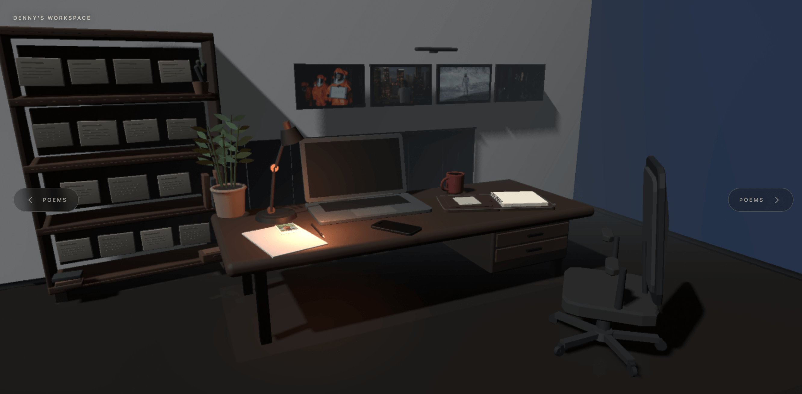
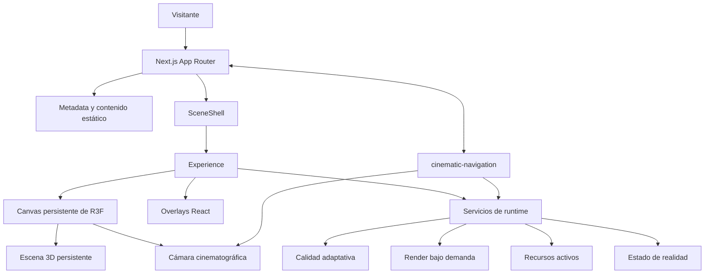
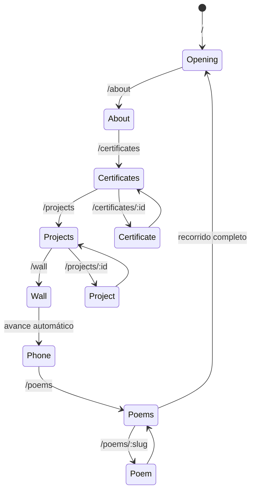
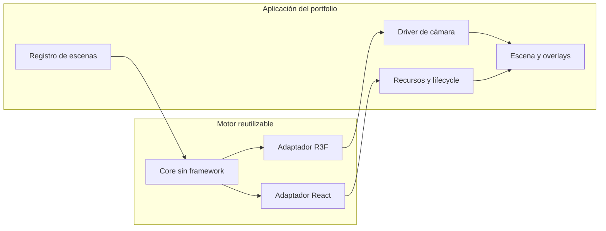
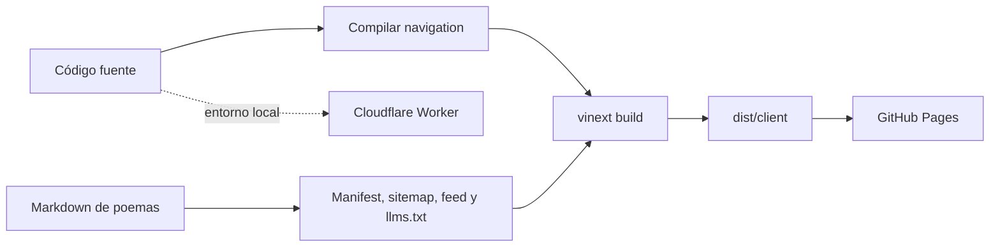

# Denny K. Schuldt — Interactive Portfolio

Un estudio creativo nocturno convertido en una experiencia WebGL interactiva. El portfolio se
recorre mediante movimientos de cámara cinematográficos para descubrir proyectos, poemas,
certificados y otros rincones del espacio.

[](https://denkschuldt.github.io/)

**Sitio:** [denkschuldt.github.io](https://denkschuldt.github.io/)

## Tecnologías

- React 19 y Next.js 16 con App Router y exportación estática.
- Vite 8 mediante vinext como pipeline de desarrollo y compilación.
- React Three Fiber 9, Drei y Three.js para la experiencia 3D.
- TypeScript 5.9 en modo estricto y Tailwind CSS 4.
- Cloudflare Workers para ejecución local/edge y GitHub Pages para producción.
- npm workspaces para el motor interno `@denk/cinematic-navigation`.

## Arquitectura general

El proyecto mantiene un único mundo y un único `<Canvas>`. Next.js resuelve las rutas y prepara
el contenido estático; la aplicación cliente conserva la escena, mientras la cámara cambia el
punto de atención. El motor de navegación es independiente del portfolio y la aplicación sigue
siendo responsable de Three.js, los recursos y la presentación.



## Recorrido de navegación

Las URLs representan destinos dentro del mismo espacio 3D. Las colecciones con foco —como
certificados o poemas— añaden un segundo nivel de navegación sin crear otro renderer.



## Estructura del repositorio

```text
.
├── app/                              # App Router, metadata y entrada del mundo
│   ├── [[...route]]/page.tsx         # Rutas estáticas, deep links y metadata por ruta
│   ├── SceneShell.tsx                # Carga diferida de la experiencia cliente
│   ├── SemanticLayer.tsx             # Documento HTML semántico por ruta (server component)
│   ├── structured-data.ts            # Grafo JSON-LD (Person, WebSite, CollectionPage…)
│   ├── site.server.ts                # Modelo unificado del sitio + llms.txt, site.json, sitemap
│   ├── site-url.ts                   # Helpers de URL canónica y escape compartidos
│   └── poems.server.ts               # Índice, feed y carga de poemas desde el sistema de archivos
├── src/content/                      # Capa de contenido pura (sin React/R3F/DOM)
│   ├── site.ts                       # Identidad del sitio, secciones y rutas canónicas
│   ├── profile.ts                    # Biografía canónica de About
│   ├── experience.ts                 # Trayectoria y experiencia profesional
│   ├── projects.ts                   # Proyectos seleccionados
│   ├── certificates.ts               # Certificaciones y credenciales
│   ├── links.ts                      # Enlaces públicos / perfiles
│   └── phone.ts                      # Metadata pública del teléfono
├── src/scene/                        # Aplicación 3D del portfolio
│   ├── camera/                       # Escenas, shots, rutas y controlador de cámara
│   ├── components/                   # Overlays y experiencias de contenido
│   ├── content/                      # Configuración y carga de contenido
│   ├── diagnostics/                  # Métricas y herramientas de rendimiento
│   ├── effects/                      # Postprocesado cinematográfico
│   ├── lighting/                     # Iluminación del mundo
│   ├── objects/                      # Geometría y objetos de la habitación
│   │   ├── Room.tsx                  # Arquitectura persistente de la habitación
│   │   ├── Desk.tsx                  # Escritorio y cajones
│   │   ├── DeskObjects.tsx           # Objetos coordinados sobre el escritorio
│   │   ├── Laptop.tsx                # Geometría y pantalla del portátil
│   │   ├── MiniProjector.tsx         # Modelo GLB del proyector
│   │   ├── Chair.tsx                 # Silla y recursos geométricos propios
│   │   ├── Shelf.tsx                 # Estantería y galería de certificados
│   │   ├── Posters.tsx               # Marcos y texturas de la pared
│   │   ├── Plant.tsx                 # Planta instanciada y maceta
│   │   ├── geometry.ts               # Helpers geométricos compartidos
│   │   ├── runtimeHooks.ts           # Integración común con el scheduler
│   │   └── certificates.ts           # Datos y distribución de certificados
│   ├── reality/                      # Estado derivado de la experiencia
│   ├── rendering/quality/            # Perfiles y calidad adaptativa
│   ├── runtime/
│   │   ├── render-scheduler/         # Producción de frames bajo demanda
│   │   └── working-set/              # Montaje y liberación de recursos
│   ├── Experience.tsx                # Composición de providers, Canvas y overlays
│   └── Scene.tsx                     # Descripción del mundo persistente
├── packages/cinematic-navigation/    # Motor headless reutilizable
│   └── src/                          # Core y adaptadores React, R3F y router
├── public/                           # Modelos, imágenes, fuentes y contenido
├── tests/                            # Pruebas de navegación, runtime y HTML
├── scripts/                          # Presupuesto de rendimiento y assets
├── docs/                             # Diseño, auditorías y despliegue
├── worker/index.ts                   # Entrada de Cloudflare Worker
└── vite.config.ts                    # vinext, Cloudflare y artefactos estáticos
```

## Límites de responsabilidad



Esta división evita que el paquete conozca IDs, imágenes o decisiones visuales del portfolio.
El motor emite intención y estados de ciclo de vida; la aplicación interpola la cámara y decide
qué texturas, modelos o tareas deben permanecer activos.

## Flujo de compilación y publicación



## Puesta en marcha

### Requisitos

- Node.js `>=22.13.0`
- npm, usando el `package-lock.json` del repositorio

```bash
npm ci
npm run dev
```

Para comprobar una versión de producción:

```bash
npm run build
npm run start
```

## Comandos principales

| Comando             | Propósito                                                      |
| ------------------- | -------------------------------------------------------------- |
| `npm run dev`       | Inicia el entorno local.                                       |
| `npm run build`     | Compila el workspace de navegación y el sitio.                 |
| `npm test`          | Compila, comprueba el presupuesto y ejecuta todas las pruebas. |
| `npm run lint`      | Ejecuta ESLint.                                                |
| `npm run format`    | Aplica Prettier.                                               |
| `npm run typecheck` | Comprueba los tipos sin emitir archivos.                       |
| `npm run quality`   | Ejecuta formato, lint y typecheck.                             |

Antes de integrar un cambio:

```bash
npm run quality
npm test
git diff --check
```

## Contenido

El contenido público (perfil, experiencia, proyectos, certificaciones, enlaces) vive como datos
puros en `src/content/`. Tanto la experiencia 3D como la capa HTML semántica del servidor consumen
esos mismos módulos, sin duplicar texto.

Los poemas viven en `public/poems/<fecha>/`, cada uno con un `poem.md` y una imagen. Durante la
compilación, `app/site.server.ts` genera desde ese modelo compartido: `sitemap.xml`, `robots.txt`,
`llms.txt`, `llms-full.txt`, `site.json`, el feed Atom de poemas, el manifiesto del cliente y las
copias en Markdown de About, Projects y Certificates. Los demás assets se organizan por dominio
dentro de `public/`.

## Evaluación de la estructura

La arquitectura está bien separada para una experiencia 3D compleja:

- El motor de navegación es reutilizable y no depende del contenido del portfolio.
- La escena es persistente y respeta renderizado bajo demanda, calidad adaptativa y ownership
  explícito de recursos.
- Las rutas profundas y los poemas siguen siendo indexables pese a la experiencia WebGL.
- Las pruebas cubren navegación, adaptadores, scheduler, working set, calidad y HTML generado.

El principal punto de atención es `src/scene/Experience.tsx`: funciona como raíz de composición,
pero concentra coordinación de providers, navegación, telemetría, Canvas y overlays. Si continúa
creciendo, conviene extraer controladores por responsabilidad sin fragmentar la lógica relacionada.

## Documentación técnica

- [Arquitectura del runtime](docs/runtime-architecture.md)
- [Sistema de cámara](docs/CAMERA_SYSTEM.md)
- [Arquitectura de cámara](src/scene/camera/ARCHITECTURE.md)
- [Paquete de navegación](packages/cinematic-navigation/README.md)
- [Despliegue](docs/DEPLOYMENT.md)
- [Auditorías y planes de rendimiento](docs/performance/)
