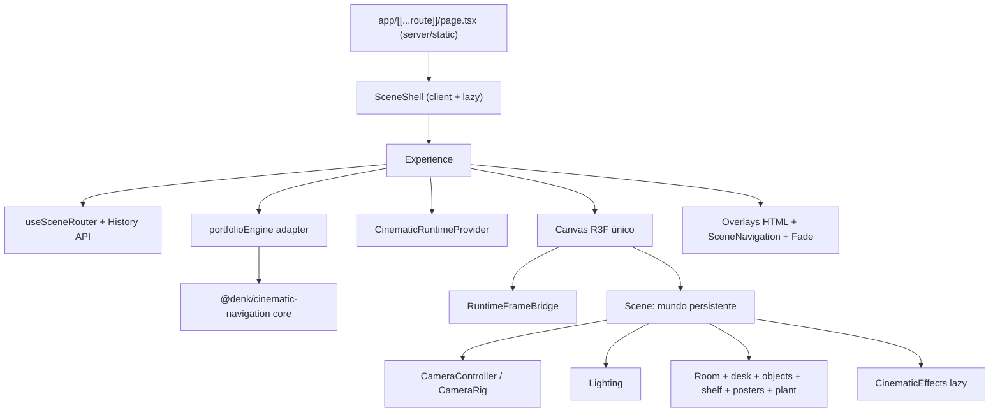
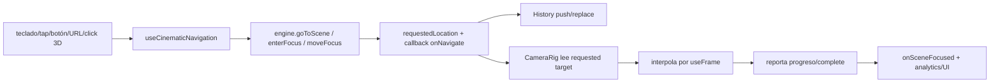
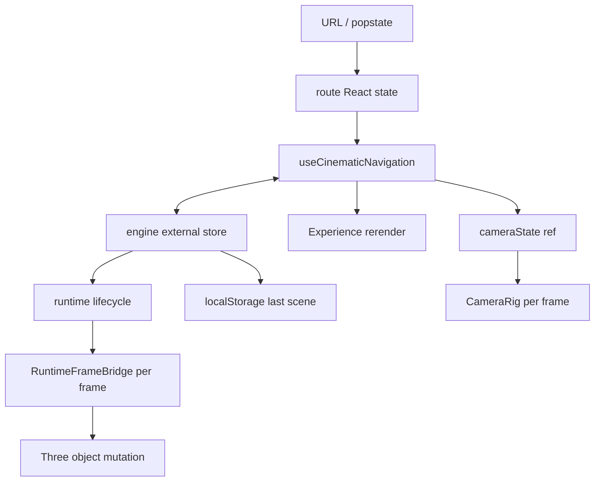

# Auditoría de infraestructura de runtime actual

Fecha del análisis estático: 2026-07-24
Repositorio: `denkschuldt.github.io`
Alcance: estado actual del código; no contiene una propuesta de rediseño.

## 1. Resumen ejecutivo

La aplicación es una exportación estática de Next/Vinext ejecutada sobre React 19 y un único `Canvas` de React Three Fiber. El portfolio no monta ocho escenas 3D aisladas. Monta una sola habitación persistente (`Scene`) con escritorio, laptop, objetos, estante, pósteres, planta, luces, cámara y postprocesado. `Opening`, `About`, `Certificates`, `Projects`, `Wall`, `Phone`, `Poems` y `Drawer` son destinos lógicos/cinematográficos dentro de ese mundo. Cambiar de Scene cambia principalmente la ubicación solicitada, el encuadre de cámara, la URL, algunos overlays y unas pocas activaciones de recursos/tareas; no desmonta el mundo.

El paquete interno `@denk/cinematic-navigation` es el motor reutilizable. Mantiene el grafo Scene → Focus Collection → Focus Item, navegación, persistencia inyectada, lifecycle genérico y scheduler de tareas. No importa React Three Fiber, Three.js ni contenido del portfolio en su núcleo. La aplicación adapta sus IDs, rutas, encuadres y reglas en `src/scene/camera`.

El `Canvas` no declara `frameloop`; por tanto usa el valor predeterminado de R3F, `always`. El loop continúa durante toda la vida del Canvas, incluso con la cámara quieta. Existen cuatro callbacks directos de `useFrame`: bridge del runtime, interpolación de cámara, proyección de la pantalla del laptop y actualización del uniforme de profundidad de campo. Además, el bridge ejecuta tareas registradas del runtime. El reader de poemas pausa el bridge, pero no pausa el frameloop ni los demás `useFrame`.

Los recursos visuales principales son procedurales y se crean como constantes de módulo. No hay GLTF/GLB, vídeo, audio, HDRI, environment map, shader personalizado ni carga DRACO/KTX2/Meshopt. Las texturas de cuatro pósteres, catorce miniaturas de certificados y `pinscher.png` se solicitan al montar el mundo. `phone.jpeg` está detrás de una frontera runtime lazy y Suspense. El preview de poema se genera como `CanvasTexture` y sustituye/dispose explícitamente. Los originales de certificados son usados por un overlay HTML mediante ``, no como texturas R3F.

El renderer está fijado a DPR `[1, 1.6]`, antialiasing WebGL, ACES Filmic, exposición `0.68`, preferencia `high-performance`, fondo opaco y sombras PCF. No existe quality tier, DPR adaptativo, adaptive events ni fallback gráfico móvil. El único ajuste gráfico por viewport es la intensidad del hemispheric fill para aspect ratios menores que `0.82`; los encuadres de cámara también tienen overrides mobile/tablet.

La pantalla “Entering workspace” deja de cubrir la experiencia cuando `Scene` agenda `onReady` en el primer `requestAnimationFrame`. Esto confirma montaje/primer frame de React, no descarga completa, compilación completa de shaders ni estabilidad de postprocesado. Los efectos se montan 350 ms después.

## 2. Mapa del repositorio

### Entry points, build y despliegue

| Grupo | Archivos | Responsabilidad y consumidores | Capa |
|---|---|---|---|
| Documento HTML | `app/layout.tsx` | Metadata global, `<html>`, `<body>`, CSS global. Consumido por Next/Vinext. | Infraestructura compartida |
| Ruta catch-all | `app/[[...route]]/page.tsx` | Genera rutas estáticas, metadata de poemas, contenido SEO oculto/alternativo y monta `SceneShell`. | Portfolio + infraestructura web |
| Entrada cliente | `app/SceneShell.tsx` | `React.lazy` de `Experience`, Suspense inicial, grain y fallback no-WebGL. | Portfolio |
| Runtime cliente | `src/scene/Experience.tsx` | Estado superior, router, motor, Canvas, overlays, analytics y coordinadores de entrada. | Portfolio/integración |
| Mundo R3F | `src/scene/Scene.tsx` | Monta el único scene graph persistente, luces, cámara, objetos y efectos. | Portfolio/renderizado |
| Build principal | `package.json`, `vite.config.ts`, `next.config.ts` | `vinext build`, export estático, Vite 8, plugin RSC, Cloudflare/Sites y generación de manifests de poemas. | Infraestructura compartida |
| Worker/datos | `worker/index.ts`, `db/*`, `drizzle.config.ts` | Adaptador Cloudflare y esquema Drizzle; no participan en el loop 3D observado. | Infraestructura compartida |

`package.json` es un workspace con `packages/*`. El build ejecuta primero TypeScript del motor y luego `vinext build`. `next.config.ts` conserva `output: "export"`, imágenes sin optimización y `assetPrefix`; el runtime efectivo de desarrollo/build viene de Vinext/Vite. `vite.config.ts` añade generación de `poems-manifest.json`, sitemap, Atom, `llms.txt` y robots, y configura bindings locales D1/R2 desde `.openai/hosting.json`.

`tsconfig.json` usa TypeScript estricto, `moduleResolution: "bundler"`, JSX automático, `noEmit` y alias `@/*`. El paquete interno tiene su propio `tsconfig.build.json` y emite su distribución antes del site.

### Motor reutilizable

| Grupo | Archivos | Qué hace |
|---|---|---|
| Core | `packages/cinematic-navigation/src/core/{engine,runtime,spatial,types}.ts` | Registros de Scene/Collection/Item, estado autoritativo, navegación, resolución espacial, lifecycle y scheduler. |
| React | `packages/cinematic-navigation/src/react/index.tsx` | Providers, selectores mediante external store, hooks de registro, `RuntimeBoundary`, tareas e inspector. |
| R3F | `packages/cinematic-navigation/src/r3f/index.ts` | `RuntimeFrameBridge` y registro genérico de subjects; conecta un frame R3F con `runtime.update`. |
| Adaptadores | `input`, `router`, `persistence`, `testing` | Intents, basename, almacenamiento inyectable y utilidades de pruebas. |
| API | `packages/cinematic-navigation/src/index.ts` y subpath exports del `package.json` | Superficie pública consumida por el portfolio. |

### Aplicación del portfolio

| Grupo | Archivos | Qué hace / quién lo importa |
|---|---|---|
| Configuración cinematográfica | `camera/sceneRegistry.ts`, `shotRegistry.ts`, `cameraTargets.ts`, `sceneLayout.ts` | IDs, secuencia, encuadres, responsive, transitions y disposición. Consumidos por engine adapter, router y cámara. |
| Integración del engine | `camera/portfolioEngine.ts`, `useCinematicCamera.ts` | Convierte registros del portfolio al contrato genérico y expone el sistema React compatible. Consumido por `Experience`, cámara y UI. |
| Driver visual | `camera/CameraController.tsx`, `CameraRig.tsx`, easing/helpers | Interpola cámara/FOV/lookAt y reporta progreso/fin al engine. Consumido por `Scene`. |
| Routing | `camera/sceneRoutes.ts`, `useSceneRouter.ts` | URL ↔ ubicación y History API. Consumido por `Experience` y página estática. |
| Objetos | `objects/Primitives.tsx`, `objects/certificates.ts` | Geometría, materiales, texturas, interacciones y tareas del cuarto. Consumido por `Scene`. |
| UI HTML | `components/CertificateGalleryOverlay.tsx`, `ProjectsOverlay.tsx`, `PoemReader.tsx`, `camera/SceneNavigation.tsx` | Overlays y navegación fuera del Canvas. Consumidos por `Experience`. |
| Contenido | `content/usePoems.ts`, `content/poems.ts`, `app/poems.server.ts` | Manifest/fetch cliente, tipos y generación server/build de poemas. |
| Render | `lighting/Lighting.tsx`, `effects/CinematicEffects.tsx`, `rendering/*` | Luces, sombras, composer y política gráfica fija. |
| Diagnóstico | `diagnostics/RenderingDiagnostics.tsx`, `NavigationDebugPanel.tsx`, `DebugHelpers.tsx` | Instrumentación de desarrollo; no define la experiencia productiva normal. |

No existe carpeta de shaders ni shader material propio. Tampoco hay modelos 3D externos. `public/` contiene imágenes, fuente y markdown. `tmp/pdfs` no es importado por el runtime.

## 3. Arquitectura actual

Las capas reales son:

1. **Engine reutilizable:** paquete `packages/cinematic-navigation`; conoce IDs genéricos y datos opacos, pero no contenido.
2. **Portfolio:** registros concretos, rutas, objetos, cámara, UI, analytics y políticas de entrada.
3. **Compartida:** Next/Vinext/Vite, generación estática, Cloudflare/Sites y base path.
4. **Visual:** `Scene`, `Primitives`, `Lighting`, `CinematicEffects`, CSS y overlays.
5. **Carga:** Suspense/lazy, Drei `useTexture`, fetch del manifest, imágenes HTML y CanvasTexture.
6. **Estado:** engine externo, runtime externo, estado React/refs, History, localStorage.
7. **Render:** Canvas, WebGLRenderer, loop R3F, composer y shadow maps.

La mezcla más importante está en `useCinematicCamera.ts`: aunque delega la lógica genérica al paquete, conserva reglas concretas de Certificates, Opening/resume, Wall visitada, browser input y el snapshot mutable requerido por el driver visual.

## 4. Flujo de inicialización

1. Vinext/Next resuelve la ruta catch-all y genera HTML/metadata; para rutas Poems lee previews en servidor/build.
2. `WorldPage` entrega `initialPath` a `SceneShell`.
3. `SceneShell` es cliente y descarga `Experience` mediante `React.lazy`; mientras tanto muestra `Entering workspace`.
4. `Experience` inicializa estados React, refs, Mixpanel y `useSceneRouter`.
5. `useCinematicNavigation` crea una instancia única del engine y, en navegador, un persistence adapter sobre `localStorage`.
6. Entrada `/`: estado actual inicial `opening`, destino solicitado `about`, intro activa. Deep link: actual y solicitado parten de la ubicación resuelta y la intro se considera completa.
7. `useCinematicRuntimeController` crea el runtime y `PortfolioRuntimeDeclaration` registra `world`, Scenes y Collections. Los nodos portfolio son lazy salvo `world`, pero esta declaración no desmonta por sí misma el scene graph.
8. React crea un único `Canvas`; R3F crea el renderer con la configuración de la sección 7.
9. Dentro del Canvas se montan `RuntimeFrameBridge` y `Scene` bajo otro provider del mismo runtime.
10. `Scene` monta luces, controlador, todos los objetos del cuarto y los hooks de textura eager. Sus Suspense pueden mantener el subtree pendiente mientras se resuelven texturas.
11. `Scene` agenda `onReady` para el siguiente `requestAnimationFrame`. `Experience` pone `sceneReady=true` y oculta progresivamente la pantalla inicial.
12. A los 350 ms `Scene` monta por lazy import `CinematicEffects`; el composer y sus render targets se crean entonces.
13. El frameloop `always` ya está activo. `CameraRig` ejecuta la intro/transición y reporta al engine.
14. En `/`, un `requestAnimationFrame` externo espera que la intro alcance Opening/Workspace y después solicita About. En entradas directas no se ejecuta ese recorrido.

### Clasificación de cargas

| Momento | Recursos |
|---|---|
| Antes del cliente | HTML, CSS y datos estáticos de poema para SEO cuando aplica. |
| Suspense inicial | Chunk de `Experience`. |
| Montaje de `Scene` | Código R3F, geometrías/materiales de módulo, pósteres (4), miniaturas de certificados (14) y `pinscher.png`; fuente CSS según uso del navegador. |
| Primer frame | La app marca `sceneReady`; esto no prueba que todos los uploads/compilaciones GPU finalizaron. |
| ~350 ms | Chunk de `CinematicEffects`, composer y efectos. |
| Al activar Phone | `PhoneScreen`, `phone.jpeg` y su luz/tarea, mediante `RuntimeBoundary` + Suspense. |
| Al activar Poems | Fetch del manifest/markdown conforme a `usePoems`; CanvasTexture del preview seleccionado; reader se descarga por lazy cuando el componente Suspense intenta renderizarse (el lazy está presente siempre, aunque `open=false`). |
| Al enfocar certificado | Overlay HTML referencia la imagen original seleccionada; el shelf conserva thumbnails. |

Bloqueos estáticos confirmables: el Suspense que rodea `Scene` puede impedir presentar el mundo hasta que terminen los `useTexture` eager de sus descendientes. El tiempo de red y el orden exacto de chunks no son determinables estáticamente.

## 5. Navegación actual

`SCENE_REGISTRY` define Scenes y `FOCUS_COLLECTIONS` define Collections/Items en `src/scene/camera/sceneRegistry.ts`. La secuencia guiada es `opening → about → certificates → projects → wall → phone → poems → opening`; Drawer está registrado pero excluido de `GUIDED_SCENE_IDS`.

El estado seleccionado vive como `requestedLocation` React en `useCinematicNavigation`; el snapshot de cámara vive en `stateRef`. El estado genérico también está en el engine. Una navegación:

- **ESC:** si Certificates detail está activo, cierra el focus. En otro caso `returnToStart` guarda la Scene actual en `resumeScene` y vuelve a Opening.
- **Resume:** el primer avance/navegación desde Opening consume `resumeScene` y regresa al checkpoint guardado. El engine también puede restaurar la última Scene persistida.
- **Teclado:** Space avanza; flechas navegan Scenes o vecinos Focus; ignora campos/controles; no actúa antes de completar intro.
- **Touch:** solo con `(pointer: coarse)`; un tap corto sobre Scenes permitidas avanza. Excluye controles interactivos.
- **Trackpad pinch:** wheel con `ctrlKey`, delta acumulado negativo, salta a `workspace`.
- **Clicks:** botones HTML llaman a Scene/focus; certificados, teléfono, poema/polaroid tienen handlers R3F.
- **Opening:** `/` arranca intro Opening con About solicitado; el watcher externo termina solicitando About. Deep links saltan la intro.
- **Wall:** `autoAdvance` espera llegada, marca Wall visitada y tras 0.18 s navega a Phone. En avances posteriores, una Wall visitada se omite. Hacia atrás se omiten todas las Scenes auto.
- **Phone:** es destino normal después de Wall; su Collection tiene `qr` y `socials`.
- **Poems:** `reframeOnFocus:false`; cambiar slug mantiene el encuadre de la Scene. El reader es overlay HTML y reemplaza URL sin mover la cámara.
- **Drawer:** es addressable internamente, pero no tiene ruta ni stop guiado; desde estado Drawer el avance vuelve a Opening.
- **Persistencia:** el engine usa clave `cinematic-room:last-scene` en `localStorage`. `visitedAutoScenes` y `resumeScene` son estado React de sesión, no se observa persistencia.

## 6. Montaje de Scenes

La siguiente tabla usa “Scene” como destino lógico. Todas comparten el mismo subtree `Scene`; no existen componentes `OpeningScene`, `AboutScene`, etc.

| Scene | Montada inicialmente | Permanece montada | Visible inactiva | useFrame activo | Raycasting activo | Luces | Sombras | Texturas/modelos residentes | Dinámicos | Activación/desactivación |
|---|---|---|---|---|---|---|---|---|---|---|
| Opening | Sí, como mundo | Sí | La misma habitación sigue visible desde otros encuadres | Cámara/proyección/DOF/bridge globales | Handlers del mundo montados; varios comprueban `active` | Globales | Globales | Texturas ambient; sin modelos | Ninguno propio | `selectedScene` + camera target |
| About | Sí | Sí | Su “contenido” es el escritorio compartido | Igual | Igual | Globales | Globales | Igual | Ninguno propio | Solo encuadre/readingMode |
| Certificates | Shelf y 14 cards: sí | Sí | Sí, el estante es parte del cuarto | Tarea de cards/LED solo habilitada por lifecycle; callbacks `useFrame` globales siguen | Cards montadas; `interactive`/estado limita acción fuera de Scene | 3 RectArea de shelf + globales; intensidades animadas | Cards/shelf proyectan/reciben | 14 thumbnails residentes; originales HTML bajo selección | Overlay seleccionado | `illuminated`, Collection y overlay |
| Projects | Laptop: sí; overlay HTML: sí | Sí | Laptop visible; overlay usa `visible` | Proyección de pantalla siempre | NO CONFIRMADO para screen mesh; overlay solo visible | Globales | Laptop proyecta | Sin screenshots locales/importados | Overlay CSS/proyección | selectedScene + readiness |
| Wall | Frames e imágenes: sí | Sí | Sí, forman la pared | Solo globales | No se observan handlers en pósteres | Globales | Frames proyectan | 4 texturas residentes | No | Cámara + autoAdvance |
| Phone | Cuerpo: sí; pantalla: lazy | Cuerpo sí; pantalla no necesariamente | Cuerpo sí; screen se desmonta al dormir según boundary | Tarea screen solo activa; globales siguen | Handlers del screen solo montados al boundary; grupo usa `active` | Luz de screen lazy + globales | Cuerpo proyecta/recibe | `phone.jpeg` cache Drei aun tras unmount: residencia GPU no confirmada | Screen/luz/tarea | `RuntimeBoundary collection:phone` |
| Poems | Portfolio físico y polaroid: sí | Sí | Sí | Tareas de preview/cue/light condicionadas por runtime; globales siguen | Handlers siguen montados, con `active` o `visible` | Luz de lectura siempre montada, intensidad a 0 fuera | Portfolio proyecta/recibe | `pinscher.png` eager; CanvasTexture reemplazable; imágenes poema son HTML/manifest | CanvasTexture | active + lifecycle tasks + overlay reader |
| Drawer | Geometría incluida en `Desk`: sí | Sí | Sí | Solo globales | Sin handlers observados | Globales | Proyecta/recibe | Sin textura/modelo propio | No | Solo camera target interno |

“Visible inactiva” significa que la geometría no se oculta por Scene; puede estar fuera del frustum o tapada desde el encuadre actual. No equivale a desmontada ni dormida. El frustum culling exacto por frame es `NO CONFIRMADO`.

No se usan React portals en el mundo. Los overlays son siblings DOM del Canvas. `visible={active}` aparece en elementos de Poems; Phone usa montaje condicional dentro de `RuntimeBoundary`. El scene graph conserva geometrías/materiales de módulo durante toda la sesión.

## 7. Render loop y renderer

### Configuración del renderer

| Propiedad | Estado actual |
|---|---|
| frameloop | No especificado en `Canvas`; predeterminado R3F `always`. |
| DPR | `[1, 1.6]`; R3F limita `window.devicePixelRatio` a ese intervalo y responde a resize. |
| Resolución buffer | CSS size × DPR resuelto; dimensiones concretas dependen del viewport. |
| Antialias | `true`. |
| Alpha | `false`. |
| powerPreference | `high-performance`. |
| Tone mapping/exposure | `THREE.ACESFilmicToneMapping`, `0.68`. |
| Output color space | No se asigna en `Canvas`; Three/WebGLRenderer instalado usa su default actual sRGB. La constante declara `"srgb"`. |
| Sombras | `"percentage"` de R3F, que resuelve a `PCFShadowMap`; desactivable solo por diagnóstico. |
| preserveDrawingBuffer | No especificado (default renderer). |
| precision/stencil/depth/logarithmicDepthBuffer | No especificados (defaults renderer/dispositivo). |
| Cámara | Perspective: `[−0.72,1.9,4.82]`, FOV 42, near .1, far 45; CameraRig modifica encuadre/FOV. |
| Adaptive DPR/events/detect-gpu | No existen. |
| Mobile | Mismo DPR/AA/efectos/sombras; camera responsive y hemispheric fill por aspect `< .82`. |

El DPR puede cambiar si cambia `devicePixelRatio` o tamaño/entorno, pero no hay monitor de performance que lo haga oscilar. No existe quality tier ni fallback mobile.

### Lista completa de `useFrame`

| Archivo/componente | Propósito | Frecuencia/prioridad | Condición y efectos |
|---|---|---|---|
| `packages/.../r3f/index.ts`, `RuntimeFrameBridge` | `runtime.update(delta, elapsed)` | Cada frame, prioridad por defecto | No actualiza el runtime si `paused`; paused solo durante PoemReader. No setState React por frame. |
| `src/scene/camera/CameraRig.tsx`, `CameraRig` | Intro, transición, waypoint, FOV, lookAt, breathing y reporte al engine | Cada frame, prioridad por defecto | Siempre montado; aun idle aplica breathing/estado visual. Usa refs/objetos Three; notificaciones lógicas al cambiar lifecycle. |
| `src/scene/Scene.tsx`, `LaptopScreenProjection` | Proyecta 4 esquinas del screen a coordenadas CSS para Projects overlay | Cada frame, prioridad por defecto | Siempre, para cualquier Scene; asigna un ref, no estado React. |
| `src/scene/effects/CinematicEffects.tsx` | Copia `focusRef.current` al uniforme DOF | Cada frame, prioridad por defecto | Sigue mientras efectos montados, incluso si post se deshabilita por diagnóstico porque el hook precede al return; no setState. |

`EffectComposer` toma prioridad de render positiva internamente y realiza el render postprocesado; no hay llamada `gl.render` manual en código del portfolio. No se encontró `invalidate()`. El composer usa `multisampling={0}`.

### Tareas ejecutadas por RuntimeFrameBridge

| Tarea | Nodo | Propósito |
|---|---|---|
| `task:coffee-steam` | `world` | Opacidad/posición/escala de 3 sprites; persistente. |
| `task:poems-polaroid` | `collection:poems` | Hover/animación del polaroid. |
| `task:poems-read-cue` | `collection:poems` | Pulso/transición del cue. |
| `task:poems-preview` | `collection:poems` | Damping visual del preview. |
| `task:poems-reading-light` | `collection:poems` | Damping de intensidad de luz. |
| `task:phone-screen` | `collection:phone` | Emisión/luz/hover del screen. |
| `task:certificates-shelf-lighting` | `collection:certificates` | Intensidad de tres RectAreaLights. |
| Certificate cards | Collection Certificates | Cada card usa actualización frame para escala/color/hover cuando runtime lo permite. |

Las tareas reciben delta del bridge y mutan objetos/materiales Three. El runtime decide ejecución por lifecycle; las declaraciones Scene/Collection son lazy y `retainOnSleep:false`. El mundo visual sigue montado aunque una tarea esté sleeping.

### RAF, timers y subscriptions fuera de R3F

- `Experience`: un RAF de diagnóstico; watcher RAF durante Opening.
- `Scene`: RAF para ready y timeout 350 ms para efectos.
- `useAutoSceneNavigation`: RAF de espera de llegada y timeout de autoAdvance.
- `SceneNavigation`: RAF, timeout e interval para etiquetas/estado visual.
- `NavigationDebugPanel`: interval 120 ms solo si montado/visible según implementación.
- `CinematicFade`: dos timeouts.
- Input: listeners `keydown`, `touchstart/end/cancel`, `wheel`, `matchMedia change`, `popstate`.
- Analytics: listeners `poem:loved` y `poem:comment`.

No se encontraron springs de `@react-spring/three`, AnimationMixers ni scroll listeners en el runtime analizado. El paquete está instalado pero no importado en los archivos revisados.

## 8. Estado y rerenders

| Sistema | Datos | Consumidores / granularidad |
|---|---|---|
| Engine externo | ubicación, registros, transition/lifecycle, last Scene | `useCinematicNavigation`, runtime; API subscribe y selectores del adapter React. |
| Runtime externo | nodos, fases, tareas, métricas | Providers, boundaries, bridge e inspector; `useSyncExternalStore` con selector en adapter. |
| React `Experience` | readiness, isolation, projects focus, reader open/slug | Rerenderiza `Experience` y propaga props al Canvas/overlays. |
| React `useCinematicNavigation` | requestedLocation, versions, resume, visitedAutoScenes, reduced motion | Cambios de navegación rerenderizan el hook/Experience. |
| Refs | cameraState, screen/projection, pending analytics, resources | Mutación por frame sin rerender React. |
| Router React | parsed route | `Experience`; `popstate`, push/replace manual. |
| localStorage | última Scene del engine | persistence adapter con clave fija. |
| History/URL | Scene/Collection/Item | `useSceneRouter` y generación estática. |
| Estado local de objetos | hovered, texturas Canvas, readiness | Subárboles concretos. |

Las actualizaciones de cámara por frame no pasan por React state; usan refs. La proyección de laptop también usa ref. Tareas runtime mutan Three imperativamente. Sí existen rerenders de alto nivel por navegación porque el objeto `cameraSystem` se reconstruye y `Experience` consume muchos campos sin selectores separados. No se puede cuantificar el coste sin React Profiler.

## 9. Inventario de recursos

### Recursos externos

| Recurso | Propietario / Scene | Tamaño y resolución | Carga/caché/disposal |
|---|---|---|---|
| 14 thumbnails Certificates | `CertificateGallery`, ambient/Certificates | Total aprox. 508 KiB; normalmente 480×352, una 480×371 y una 480×351; JPEG | `useTexture(array)` al montar Scene; caché loader Drei/Three; compartidas entre cards; no disposal manual. |
| 14 originales Certificates | Overlay HTML | 144–299 KiB cada uno; 776×600, 818/819×600 o ~1920×1408; JPEG/PNG | Navegador carga la seleccionada por ``; no textura R3F; caché/discard control navegador. |
| Wall | `PosterImages` / Wall ambiental | arrival 121,137 B 1920×1200; her 30,699 B 728×410; interstellar 43,592 B 728×410; matrix 9,966 B WebP 598×362 pese a extensión `.jpg` | Las 4 con `useTexture` al montaje; resident/cached; sin disposal manual. |
| `phone.jpeg` | `PhoneScreen` / Phone | 41,724 B; 675×1200 JPEG | `useTexture` solo al montar boundary Phone; caché loader; no disposal manual. |
| `pinscher.png` | `PortfolioPhoto` / Poems ambient | 141,437 B; 567×612 PNG | Eager al montar mundo; persistente; no disposal manual. |
| 30 imágenes Poems | PoemReader/contenido | WebP; 35,518 B–1,165,250 B; resolución no determinada por `file` en esta pasada | URLs llegan por manifest; carga HTML/browsing según reader; no textura R3F observada. |
| 30 markdown Poems | `usePoems`, build/server | 618–4,996 B en poemas reales observados | Manifest/fetch condicionado a Poems; caché HTTP no determinada. |
| Patrick Hand | CSS/Poems | 214,772 B TTF | Carga del navegador según `@font-face`/uso CSS; no recurso GPU Three. |

No existen GLTF/GLB, vídeo, audio, HDRI/environment maps, LUT, documentos runtime ni modelos externos. `tmp/pdfs/*.png` no tiene import runtime.

### Recursos generados

- Decenas de `BufferGeometry`, `ExtrudeGeometry`, `ShapeGeometry` y materiales se crean una vez al evaluar `Primitives.tsx`; se reutilizan mediante constantes y `instancedMesh`.
- `useMacBookShellGeometry` memoiza geometrías por parámetros.
- `CoffeeSteam` crea tres `SpriteMaterial` con `useMemo` y los dispone en cleanup; la `DataTexture` de módulo persiste.
- `usePoemPreviewTexture` crea una `CanvasTexture`; al cambiar se dispone la anterior y el cleanup dispone la vigente.
- `CinematicEffects` crea composer/render targets y `ManagedEffectComposer` llama `composer.dispose()` al desmontar.
- Phone, portfolio y numerosos grupos usan `dispose={null}` para evitar auto-disposal de recursos compartidos.
- Materiales inline `<meshStandardMaterial>` son gestionados por reconciliación R3F al desmontar, pero el mundo normalmente no se desmonta.
- No se observan render targets secundarios fuera del composer, N8AO, DOF/Bloom y `ContactShadows`.

La residencia GPU exacta tras un unmount no puede probarse estáticamente. `useTexture` mantiene caché de loader; no hay `useTexture.clear`, por lo que una descarga no implica liberación de caché/GPU.

## 10. Luces y sombras

### Luces

| Luz | Tipo / intensidad | Montaje | Shadow / parámetros |
|---|---|---|---|
| `hemisphere-fill` | Hemisphere; `bounce*.16` desktop = .0992, `bounce*1.25` mobile = .775 | Global si fill | No shadow |
| `moon-key` | Directional 1.05, distancia N/A | Global | cast; 2048²; bounds L/R ±6, top 6, bottom −3; bias −0.00018 |
| `desk-key` | Spot 19, distance 7, angle .48, penumbra .92, decay 2 | Global | cast; 2048²; bias −0.00012 |
| `desk-fill` | Point 3.8, distance 2.7, decay 2 | Global si fill | No |
| `wall-bounce` | RectArea .62, 4.4×1.6 | Global si fill | No |
| `drawer-rim` | Point .434, distance 3.2 | Global si fill | No |
| `upper-warm-fill` | RectArea 1.35, 5.2×1.35 | Global si fill | No |
| Desk lamp | Spot 7.2, distance 2.15, angle .55 | Siempre | No castShadow declarado |
| Shelf practical ×3 | RectArea, intensidad animada | Siempre montadas; tarea Certificates | No |
| Poems reading | Point 0→4.5, distance 1.4 | Siempre montada; tarea Poems | No |
| Phone screen | Point, intensidad animada, distance .9 | Solo boundary Phone | No |

`ContactShadows` global se monta si shadows están habilitadas: posición `[0,.012,-.8]`, opacity `.48`, scale 12, blur 3.4, far 4.5. Crea su propio render target/paso de profundidad internamente; resolución no se especifica y queda en default de Drei.

El inventario JSX contiene numerosos `castShadow`/`receiveShadow`: habitación, escritorio/drawer, laptop, objetos, shelf/cards, posters, planta y chair. Debido a instancing y mapas JSX, un conteo de meshes renderizados no equivale al conteo textual. Aproximación estática por Scene lógica: el mismo conjunto global (decenas de meshes, más instancias) proyecta/recibe en todas las Scenes; Phone añade su cuerpo ya persistente, no un shadow caster lazy significativo; la pantalla no declara castShadow. Un conteo exacto de drawables y pases requiere inspección runtime.

No se declara `normalBias`. Far/near de las shadow cameras no se personalizan. Las luces globales permanecen activas en todas las Scenes; frustum de cámara no desactiva luces ni shadow casters automáticamente.

## 11. Postprocesado

Pipeline único, renderer-wide y sin variantes por Scene/dispositivo:

1. `EffectComposer`, `multisampling=0`.
2. `N8AO`: radius 1.7, intensity .32, distanceFalloff 1.2.
3. `DepthOfField`: focusDistance mutable, focalLength .035, bokehScale `.45` o 0 en readingMode, height 480.
4. `Bloom`: intensity `.08` o 0 en readingMode, threshold .84, smoothing .18, mipmap blur.
5. `HueSaturation`: hue −.012, saturation −.12.
6. `Vignette`: offset .32, darkness .22.

No hay noise, chromatic aberration, outline, LUT, SMAA/FXAA pass ni shader pass personalizado. Tone mapping ocurre en WebGLRenderer. N8AO/Bloom/Vignette pueden deshabilitarse por query solo en desarrollo; no es una política de Scene. El composer se monta tras 350 ms y permanece estable. Sus render targets y los internos de efectos no exponen tamaño completo en código; DOF sí fija altura 480. El cleanup explícito dispone el composer.

## 12. Interacción y raycasting

Handlers R3F confirmados:

- Polaroid de portfolio: pointer over/out y click; comprueba `active`.
- Cue y preview de poema: pointer over/out/click; cue usa `visible={active}`.
- Phone screen: pointer over/out/click; montado solo en Phone boundary.
- Certificate cards: pointer over/out/click; comprueban `interactive` antes de selección.

La UI DOM añade clicks/focus para navegación, gallery, projects y reader. No se configura raycaster, event layer ni event filter en `Canvas`; se usan defaults R3F. No hay handlers pointer move/down/up explícitos encontrados en el scene graph.

Objetos inactivos con handlers pueden seguir incluidos en el scene graph y, si permanecen visibles, ser candidatos al raycaster; que el handler retorne temprano no evita necesariamente la intersección. `visible={false}` excluye normalmente el objeto y descendientes del raycast de Three, mientras un simple flag `active` no. Certificates y polaroid permanecen montados; por tanto su coste exacto de intersección fuera de Scene es candidato a medición. Phone screen se desmonta/sleep según boundary.

Listeners globales: keyboard, touch start/end/cancel, wheel/pinch, popstate, media query y dos eventos custom de poemas. No hay una rama específica por iPad; “mobile” se deduce por aspect ratio para render y coarse pointer para tap.

## 13. Carga, caché y disposal

- `React.lazy`: `Experience`, `CinematicEffects`, `PoemReader`.
- `Suspense`: shell, Scene, Effects, Phone screen y Reader.
- `useTexture`: pinscher, phone, certificate thumbnails y wall.
- No hay `useGLTF`, `GLTFLoader`, `TextureLoader` manual, DRACO, KTX2, Meshopt ni preload explícito.
- `usePoems` usa carga de contenido/manifest condicionada por Scene Poems.
- El build genera un manifest de poemas; no existe manifest general de assets 3D.
- Las geometrías/materiales de módulo se comparten y persisten; varios grupos usan `dispose={null}` deliberadamente.
- Disposal manual confirmado: CanvasTexture de poema anterior/cleanup, tres SpriteMaterials de vapor y EffectComposer.
- No hay limpieza manual de texturas `useTexture` ni de la DataTexture global.
- Las imágenes HTML quedan bajo la caché del navegador; las texturas Drei bajo caché del loader.
- No se observa virtualización de certificados ni poemas. Los 14 thumbnails/cards están simultáneamente montados. Los 30 registros de poema se registran en el engine a la vez después de cargar manifest; el reader recibe el array completo. No existe preload explícito anterior/siguiente.

Posibles retenciones a medir, no leaks demostrados: caches `useTexture`, recursos de módulo hasta descarga de página, imágenes visitadas del reader en cache navegador y render targets internos de efectos. El composer y CanvasTexture tienen cleanup explícito, lo que reduce una fuga evidente.

## 14. Engine vs Portfolio

| Clasificación | Sistema | Evidencia |
|---|---|---|
| A — engine correcto | Grafo genérico, guided sequence execution, focus/spatial, lifecycle/scheduler, persist adapter contract | `packages/cinematic-navigation/src/core` no importa IDs/contenido/Three. |
| A | React selectors/providers y frame bridge genéricos | Subpath adapters del paquete. |
| B — portfolio correcto | Registries concretos, rutas, framing, camera breathing/waypoints, objetos, assets, luces, effects, overlays, Mixpanel | Todo bajo `src/scene`/`app`. |
| B | Política de carga/disposal de texturas y CanvasTexture | `Primitives.tsx`, `usePoems.ts`. |
| C — compartida con interfaz clara | `portfolioEngine.ts` | Traduce definitions concretas a registrations genéricas. |
| C | `RuntimeFrameBridge` + `useRuntimeTask` | Engine agenda; portfolio define la mutación Three. |
| C | Persistence | Engine acepta adapter; portfolio elige `window.localStorage` y key. |
| D — mezcla actual | `useCinematicCamera.ts` | En un hook conviven adaptación del engine, React state, localStorage, reglas Certificates/Opening/resume/Wall, listeners DOM y API legacy. Afecta Experience, UI y CameraRig. |
| D — mezcla actual | `Experience.tsx` | Orquesta runtime, routing, analytics, readiness, overlays, Canvas y reglas de poemas/proyectos. Su dependencia amplia hace que navegación y UI compartan un límite de rerender. |
| D — semántica parcial | Declaraciones runtime de Scene | Se registran nodos lazy, pero el mundo único no está envuelto por boundaries por Scene; el lifecycle describe tareas/recursos puntuales, no montaje real de geometría por Scene. |

Esta clasificación describe ubicación/acoplamiento; no prescribe todavía el movimiento de código.

## 15. Análisis por Scene

### Opening

No tiene componente propio. Usa el cuarto entero, cámara target `opening`/`workspace`, luces y sombras globales. La intro vive en CameraRig/engine/Fade. El watcher de `Experience` usa RAF hasta pasar a About. ESC puede estacionar aquí y guardar resume. Al salir permanecen mundo, texturas ambient, loop, listeners y effects.

### About

Es un encuadre del escritorio dentro del mismo mundo. No carga asset propio ni monta geometría. Activa `readingMode` del postprocesado, anulando DOF/Bloom según props actuales. No tiene Collection. Persisten todos los recursos al salir.

### Certificates

El shelf, decor, catorce cards, thumbnails y tres luces prácticas existen desde el montaje inicial. `illuminated` activa su presentación y tareas. Todos los Focus Items están registrados simultáneamente y todas las miniaturas cargadas. El detalle es `CertificateGalleryOverlay` HTML; cambiar item no reframing (`reframeOnFocus:false`). Handlers de cards siguen montados fuera de la Scene, aunque la lógica `interactive` limita la acción. No hay virtualización ni disposal de thumbnails/originales.

### Projects

La laptop existe siempre. `LaptopScreenProjection` calcula su cuadrilátero cada frame en todas las Scenes. `ProjectsOverlay` está montado como componente DOM y recibe `visible` solo cuando Scene, cámara, fade y readiness coinciden. No se observan screenshots/assets locales de proyecto. La Collection está declarada dinámica pero no se observan Items estáticos en el registry.

### Wall

Frames y cuatro texturas se montan desde el inicio y permanecen como ambient room. No hay handler R3F observado. Al llegar, autoAdvance espera estado de cámara, marca Wall visitada, espera .18 s y navega a Phone. Una visita posterior hacia adelante la omite; hacia atrás también se omiten auto scenes. Su Collection es dinámica y actualmente sin Items estáticos.

### Phone

El cuerpo del teléfono es persistente. La pantalla, textura `phone.jpeg`, point light y tarea están detrás de `RuntimeBoundary collection:phone`; se montan cuando el runtime permite el nodo y `screenLoaded` es cierto. Los clicks abren una URL externa. Hay dos Focus Items lógicos (`qr`, `socials`); no representan dos texturas virtualizadas. Al salir el subtree puede desmontarse, pero la caché de `useTexture` no se limpia.

### Poems

El portfolio físico, polaroid, `pinscher.png`, páginas y luz de lectura están montados siempre. Al activar Poems se carga contenido, se registran todos los Focus Items dinámicos y se genera CanvasTexture para el preview seleccionado. Tasks modifican preview/cue/light/polaroid solo bajo lifecycle. Cambiar poema no mueve la cámara. `PoemReader` es overlay DOM; al abrirlo, el runtime bridge queda paused, pero CameraRig/proyección/DOF y el render WebGL siguen por frame. No hay virtualización ni preload explícito de vecinos. CanvasTexture sí se dispone al sustituir.

### Drawer

`Drawer` es geometría interna de `Desk`, montada siempre, con sombras. No tiene asset, Collection, interacción ni tarea propia. Existe registry/camera target pero se excluye de la guía y no tiene ruta pública. Es un caso claro donde “Scene” es únicamente un destino de cámara sobre geometría global.

## 16. Matriz de estado actual

Leyenda aplicada literalmente al comportamiento comprobable. “Mounted but hidden” solo se usa para UI con `visible`/CSS; geometría fuera del encuadre se marca “Fully active” porque sigue en el scene graph.

| Estado | Scene geometry | Other Scene geometry | Textures | useFrame | Raycasting | Lights | Shadows | Postprocessing | Focus Collections | Focus Items | Videos | Render targets | React subscriptions |
|---|---|---|---|---|---|---|---|---|---|---|---|---|---|
| Opening | Fully active | Fully active | Loaded but unused/ambient | Fully active | Fully active | Fully active | Fully active | Fully active | Sleeping | Loaded but unused | Unmounted | Fully active | Fully active |
| About | Fully active | Fully active | Loaded but unused/ambient | Fully active | Fully active | Fully active | Fully active | Fully active | Sleeping | Loaded but unused | Unmounted | Fully active | Fully active |
| Certificates | Fully active | Fully active | Fully active (thumbs) | Mounted and updating | Fully active | Mounted and updating | Fully active | Fully active | Fully active | Fully active | Unmounted | Fully active | Fully active |
| Projects | Fully active | Fully active | Loaded but unused/ambient | Fully active | Fully active | Fully active | Fully active | Fully active | Fully active logical | Unknown/dynamic empty | Unmounted | Fully active | Fully active |
| Wall | Fully active | Fully active | Fully active (wall) | Fully active | Fully active | Fully active | Fully active | Fully active | Fully active logical | Unknown/dynamic empty | Unmounted | Fully active | Fully active |
| Phone | Fully active + lazy screen | Fully active | Fully active phone + ambient | Mounted and updating | Fully active | Mounted and updating | Fully active | Fully active | Fully active | Fully active logical | Unmounted | Fully active | Fully active |
| Poems | Fully active | Fully active | Fully active preview/ambient | Mounted and updating | Fully active | Mounted and updating | Fully active | Fully active | Fully active | Fully active (todos registrados) | Unmounted | Fully active | Fully active |
| Drawer | Fully active | Fully active | Loaded but unused/ambient | Fully active | Fully active | Fully active | Fully active | Fully active | Unmounted | Unmounted | Unmounted | Fully active | Fully active |

## 17. Hallazgos

| Categoría | Hallazgo y evidencia | Impacto probable | Confianza | ¿Medición? |
|---|---|---|---|---|
| Arquitectura | Scenes son ubicaciones, no boundaries de geometría (`Scene.tsx` monta todo). | Cualquier estrategia futura basada en “unmount Scene” no describe el estado actual. | Alta | No |
| Render loop/CPU | `frameloop` default always y 4 `useFrame`, incluida proyección de laptop global. | Trabajo continuo aun idle. | Alta | Sí, Performance panel |
| CPU | Coffee steam world task permanece activa; otras tasks se lifecycle-gatean. | Coste continuo pequeño/no cuantificado. | Alta | Sí |
| GPU | Composer global con N8AO, DOF, Bloom, grading y vignette. | Múltiples full-screen/render-target passes por frame. | Alta | Sí, GPU profiler |
| GPU/Sombras | Dos shadow maps 2048² + ContactShadows globales. | Memoria y tiempo GPU persistentes. | Alta | Sí |
| Memoria/Texturas | 14 thumbnails + 4 wall + pinscher se cargan al montar y no se limpian manualmente. | Working set de textura ambiental persistente. | Alta | Sí, renderer.info/devtools |
| Carga inicial | Suspense del mundo incluye `useTexture` eager de ambient assets. | Puede retrasar primera presentación según red/cache. | Alta | Sí, waterfall |
| React | Navegación rerenderiza `Experience` y props amplias; estado por frame usa refs correctamente. | Coste de reconciliación por navegación, no por frame. | Media/alta | React Profiler |
| Raycasting | Cards/polaroid con handlers permanecen montados; flags active no garantizan exclusión de intersección. | Intersecciones de objetos inactivos posibles. | Media | Instrumentar raycaster |
| Mobile/iPad | No quality tier/adaptive DPR; mismo pipeline en mobile, salvo fill/cámara. | Carga GPU equivalente con menor presupuesto térmico. | Alta | Safari/iPad real |
| Navegación | Wall autoAdvance depende de RAF + timeout y estado React visitado de sesión. | Comportamiento temporal correcto en código, sensible a background throttling. | Alta | Prueba background/resume |
| Carga | Phone desmonta subtree pero `useTexture` cache no se limpia. | Remontaje rápido; liberación real de GPU no garantizada. | Alta | Memory snapshot |
| Mantenibilidad | `useCinematicCamera.ts` y `Experience.tsx` concentran reglas de varias capas. | Cambios cruzados y superficie amplia de regresión. | Alta | No |
| Disposal | Composer, CanvasTexture y steam materials tienen cleanup; recursos de módulo persisten. | No hay fuga evidente en esos tres casos; working set dura la sesión. | Alta | Sí para confirmar GPU |
| Visual | Drawer no es una Scene montable pese al ID; está embebido en Desk. | Riesgo de interpretación errónea en futuras métricas por Scene. | Alta | No |

Estos hallazgos identifican candidatos de medición; no constituyen una estrategia de optimización.

## 18. Información que no puede determinarse solo mediante análisis estático

| Dato no determinable | Prueba necesaria |
|---|---|
| FPS, CPU frame time y dropped frames por Scene/dispositivo | Chrome Performance + R3F/Stats en sesiones repetibles. |
| GPU frame time y coste de cada pass | Spector.js/WebGL inspector o EXT_disjoint_timer_query; capturas por Scene. |
| Memoria GPU real de texturas, shadow maps y targets | Spector.js, `renderer.info`, snapshots antes/después y tooling del dispositivo. |
| Residencia GPU después de unmount Phone | Comparar renderer info y capturas de recursos tras GC/context idle. |
| Orden/tiempo real de chunks y assets | Network waterfall con cache cold/warm y throttling. |
| Compilación de shaders y stutter del primer uso | Performance trace y `KHR_parallel_shader_compile`/captura WebGL. |
| Número exacto de draw calls, triangles y shadow casters por encuadre | `renderer.info.render` y captura Spector por Scene. |
| Intersecciones/raycast candidates por evento | Instrumentar event manager/raycaster y probar cada Scene. |
| Coste de reconciliación de navegación | React Profiler. |
| Safari iPad, precisión efectiva, WebGL limits y thermal throttling | Dispositivo físico, Safari Web Inspector y prueba sostenida. |
| Garbage collection y leaks de larga sesión | Heap snapshots/timeline tras ciclos repetidos. |
| Resolución interna/defaults exactos de ContactShadows/N8AO para la versión resuelta | Inspección runtime de targets o fuente empaquetada + captura. |
| Cuándo el navegador decodifica imágenes HTML de poemas/certificados | Performance/Network/Image decode trace. |
| Frustum culling efectivo por cámara | Inspección de renderer lists/captura por frame. |
| Accesibilidad/latencia de input real | Pruebas de usuario y Event Timing API. |

## 19. Preguntas abiertas

1. ¿El build desplegado en producción corresponde exactamente al commit auditado? El análisis solo cubre el working tree local.
2. ¿Los Collections dinámicos Projects y Wall se registran desde una fuente externa no presente? En el código inspeccionado sus `items` empiezan vacíos.
3. ¿Qué política interna exacta aplica la versión instalada de Drei a la resolución de `ContactShadows`? No se configura localmente.
4. ¿Qué recursos conserva el cache de `useTexture` después del lifecycle Phone en los navegadores objetivo? Requiere medición.
5. ¿El overlay `PoemReader` provoca descarga anticipada de su chunk aun cerrado en el build final? El componente lazy está en el árbol; el scheduling exacto del bundler/browser requiere waterfall.
6. ¿Qué targets y formatos selecciona `postprocessing` en cada GPU? Depende de capabilities runtime.
7. ¿Cuántas Cards/meshes terminan en la lista de raycast fuera de su Scene? Los handlers y flags permiten inferir riesgo, no el conjunto final sin instrumentación.

## Referencias principales

- Entrada y providers: `app/[[...route]]/page.tsx`, `app/SceneShell.tsx`, `src/scene/Experience.tsx`.
- Mundo persistente: `src/scene/Scene.tsx:44-65`.
- Canvas/renderer: `src/scene/Experience.tsx:289-310`.
- Registry y secuencia: `src/scene/camera/sceneRegistry.ts`.
- Navegación/input/persistencia: `src/scene/camera/useCinematicCamera.ts`.
- Routing: `src/scene/camera/sceneRoutes.ts`, `src/scene/camera/useSceneRouter.ts`.
- Driver por frame: `src/scene/camera/CameraRig.tsx`.
- Objetos/recursos/interacción: `src/scene/objects/Primitives.tsx`.
- Luces: `src/scene/lighting/Lighting.tsx`.
- Postprocesado: `src/scene/effects/CinematicEffects.tsx`.
- Política gráfica: `src/scene/rendering/renderingIntent.ts`.
- Engine/runtime/adapters: `packages/cinematic-navigation/src`.
