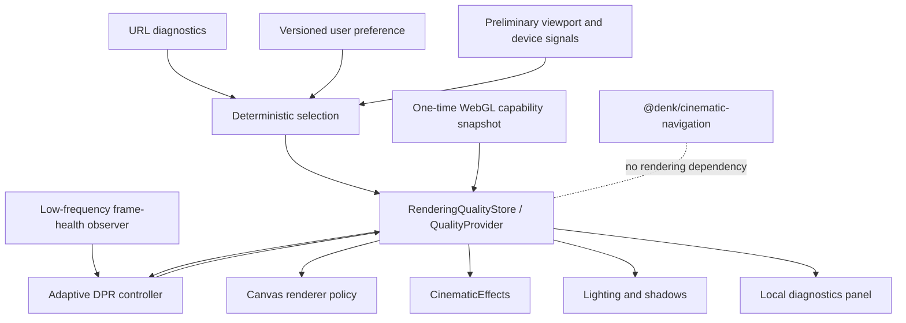
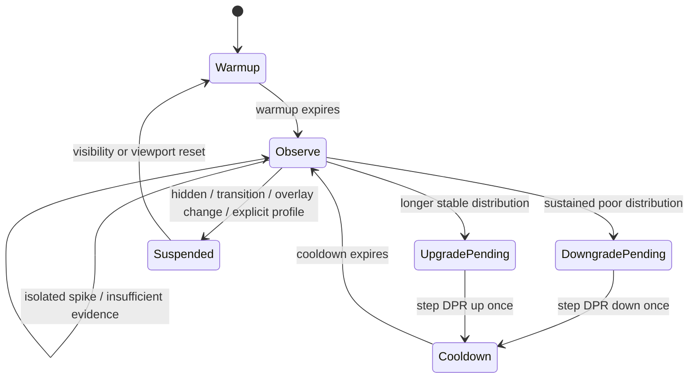

# Phase 2 — Adaptive rendering design

## Outcome

Rendering quality is now portfolio-owned policy under
`src/scene/rendering/quality/`. The cinematic-navigation package remains
renderer-agnostic and the application still uses one persistent Canvas and one
persistent room graph.

## Pre-implementation audit

| Decision                  | Previous owner                | Previous value                                    | Consumers               | Centralised?                   | Runtime-changeable?        |
| ------------------------- | ----------------------------- | ------------------------------------------------- | ----------------------- | ------------------------------ | -------------------------- |
| Canvas DPR                | `Experience`                  | `[1, 1.6]`                                        | R3F renderer            | No                             | Yes                        |
| Antialias                 | `Experience`                  | `true`                                            | WebGLRenderer           | No                             | No; renderer creation      |
| Power preference          | `Experience`                  | high-performance                                  | WebGLRenderer           | No                             | No; renderer creation      |
| Global shadows            | `Experience`                  | enabled, percentage type                          | renderer/lights         | No                             | Partly                     |
| Directional shadow        | `Lighting`                    | enabled, 2048                                     | moon key                | No                             | Yes, with resource remount |
| Desk spot shadow          | `Lighting`                    | enabled, 2048                                     | desk key                | No                             | Yes, with resource remount |
| ContactShadows            | `Lighting`                    | enabled, 512, blur 3.4, opacity .48               | floor pass              | No                             | Yes, by mount lifecycle    |
| EffectComposer            | `CinematicEffects`            | enabled                                           | full frame              | No                             | Yes, by mount lifecycle    |
| N8AO                      | `CinematicEffects`            | radius 1.7, intensity .32, default medium quality | full frame              | No                             | Yes                        |
| DepthOfField              | `CinematicEffects`            | height 480, focal .035, bokeh .45                 | full frame              | No                             | Yes                        |
| Bloom                     | `CinematicEffects`            | .08/.84/.18, mipmap                               | full frame              | No                             | Yes                        |
| Hue/Saturation            | `CinematicEffects`            | -.012/-.12                                        | full frame              | No                             | Yes                        |
| Vignette                  | `CinematicEffects`            | .32/.22                                           | full frame              | No                             | Yes                        |
| Camera near/far           | `Experience`                  | .1/45                                             | camera/navigation       | Intentional camera policy      | Session-start              |
| Light count/intensity     | `Lighting` and scene settings | seven lights; shot-driven intensities             | composition             | Intentional composition policy | Yes                        |
| Responsive camera framing | shot registry/navigation      | destination-specific                              | camera rig              | Centralised outside quality    | Yes                        |
| Mobile fill/breathing     | rendering intent/camera rig   | aspect and reduced-motion driven                  | lighting/camera         | Separate concern               | Yes                        |
| Diagnostics               | performance store             | `perf`, `perfDpr`, `perfDisable`                  | renderer/effects/lights | Partly                         | Yes                        |

Camera framing, light composition, material authorship and accessibility remain
separate from GPU quality. Their values were audited but were not moved into a
profile merely to make the profile larger.

## Architecture and ownership

- `types.ts` defines the policy, capability, selection, health and history
  contracts.
- `profiles.ts` is the single numerical profile catalogue.
- `capabilityDetection.ts` collects preliminary and post-WebGL signals.
- `qualitySelection.ts` parses preferences/overrides, selects the initial
  profile and resolves effective feature flags.
- `adaptiveController.ts` is a pure state machine.
- `QualityProvider.tsx` owns the external store, persistence and narrow
  selector API.
- `QualityRuntimeBridge.tsx` connects R3F frame samples and safe `setDpr`
  mutation to the store.

## Capability snapshot

Before Canvas creation, selection uses CSS viewport size, device pixel ratio,
estimated pixel workload, pointer/touch signals, reduced motion,
`hardwareConcurrency`, optional `deviceMemory`, and a conservative iOS hint.
After renderer creation a single immutable session snapshot adds WebGL version,
texture/renderbuffer/unit limits, anisotropy, fragment precision, debug
renderer/vendor when exposed, resolved DPR and drawing-buffer dimensions.

`hardwareConcurrency`, `deviceMemory` and user-agent-derived iOS detection are
weak supporting signals. No single iPad label determines the profile. Resize
and orientation changes reset the frame window without rewriting the immutable
renderer capability record.

## Selection precedence

1. Individual `perfDisable` feature switches determine effective feature flags.
2. `perfProfile` forces the profile.
3. `perfDpr` forces a bounded DPR and suspends adaptation.
4. A valid persisted user choice forces its named profile.
5. Accessibility is recorded independently; reduced motion never implies a
   low-GPU profile.
6. Pixel workload and conservative mobile-capability heuristics select Auto.
7. Desktop capability is the safe current-production default.

The selection result includes profile ID, reason code, supporting signals,
`userForced`, and whether adaptation is allowed. Invalid stored values and
invalid diagnostic values are ignored safely and exposed as warnings.

## Runtime mutability

| Class                        | Fields                                                                                         | Behaviour                                                                                      |
| ---------------------------- | ---------------------------------------------------------------------------------------------- | ---------------------------------------------------------------------------------------------- |
| Runtime mutable              | DPR, effect flags/parameters, shadow enablement, shadow resolutions, contact-shadow parameters | Applied without replacing Canvas or navigation state                                           |
| Explicit resource lifecycle  | composer targets, ContactShadows, directional/spot shadow maps                                 | Unmounted/disposed or keyed remount when the profile changes                                   |
| Renderer recreation required | antialias, power preference, renderer context attributes                                       | Chosen before Canvas creation; changing the selector during a session does not recreate Canvas |
| Session composition policy   | camera near/far, tone mapping, authored lights/materials                                       | Intentionally not adapted in Phase 2                                                           |

A future production settings surface should explain that antialias and power
preference changes fully apply after reload. Ordinary adaptive operation changes
only DPR.

## Frame-health and adaptive state machine

The observer stores frame durations outside React and evaluates a rolling
30-second window once per second. It reports median, p95, over-budget ratio,
longest frame, duration and contextual flags. Profile targets are conservative
fallback budgets (16.67, 20, 22.22 or 33.33 ms); reliable refresh-rate inference
is not claimed in this phase.

Downgrades require sustained poor windows and occur faster than upgrades.
Discrete per-profile levels, hysteresis, warm-up, cooldown and a longer stable
duration prevent oscillation. Samples are ignored while hidden, during camera
transitions, while modal/reader state changes, and after viewport reset. Every
change records timestamp, old/new DPR, reason and the health snapshot.
Automatic full-profile switching is intentionally prepared by the model but not
enabled in production Phase 2.

## Accessibility and navigation safety

Reduced motion remains an accessibility input used by the existing camera
behaviour and is recorded by quality selection; it does not force Mobile.
Quality state lives above the persistent Canvas and never enters
`@denk/cinematic-navigation`. Profile or DPR changes therefore do not replace
the navigation store, active destination, focus URL or camera rig.
