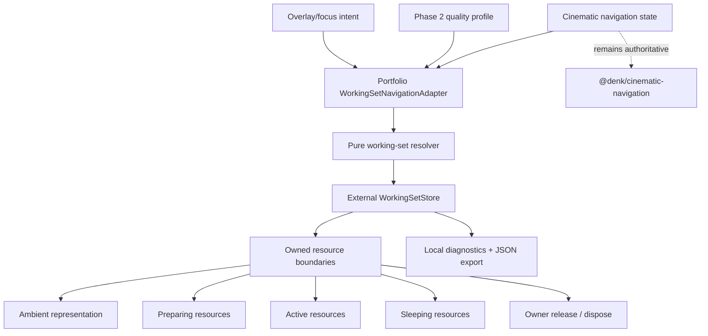
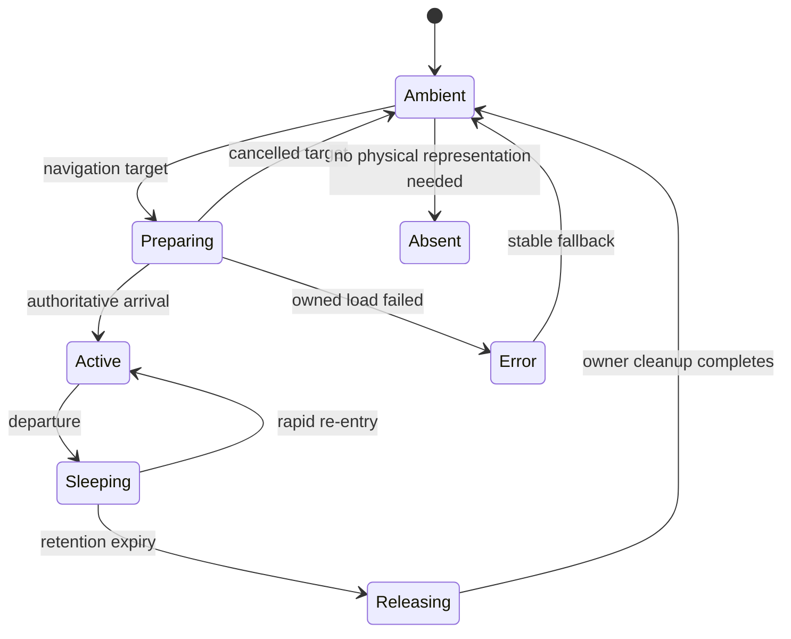

# Phase 3 — Working-set design

## Architecture

Working-set policy is portfolio-owned under
`src/scene/runtime/working-set/`. It consumes the authoritative navigation
engine but never writes to it.

The navigation adapter reads `sceneId`, `requestedSceneId`, transition status,
focus and overlay intent. The resolver derives current, approaching, sleeping
and release candidates. It does not maintain a second camera/navigation state
machine.

## Lifecycle

An ambient mesh never observes a half-disposed texture. The resource subtree is
removed first; its owner cleanup drops references and calls `dispose()` where it
owns a Three texture. Shared resources follow an alternative path:
`Active → Sleeping (session retained)` and are never locally disposed.
Overlay-only resources are higher priority and live with their overlay.

## Destination definitions

`definitions.ts` declares resources, owners, class, preparation requirement,
fallback, lead time and per-profile retention. Scene IDs are intentionally not
added to the Phase 2 rendering-profile type. The portfolio maps:

`profile + destination + resource → retention/variant policy`.

No nonexistent file variants are selected. Lower profiles currently tighten
retention; file variants remain a future asset-pipeline concern.

## Preparation and priority

Priority is deterministic:

1. open overlay;
2. selected focus item;
3. current destination;
4. navigation target;
5. shared ambient resources;
6. speculative next destination only when later enabled by a budget.

The current implementation prepares the actual navigation target, not every
guided destination. Loads are deduplicated by boundary ownership. Each
destination has a monotonically increasing generation; stale async completions
are rejected, and owned TextureLoader callbacks dispose a result that completes
after cancellation.

The ambient representation remains mounted while preparation runs: shelf and
frames, dark phone screen, notebook and dark page/photo fallbacks.

## Retention

One store owns all timers. There are no per-component release timers.

| Profile | Certificates | Projects | Phone | Poems | Speculation |
| --- | ---: | ---: | ---: | ---: | --- |
| Ultra | 30 s | 10 s | 20 s | 30 s | target preparation allowed |
| High | 20 s | 8 s | 12 s | 20 s | target preparation allowed |
| Balanced | 12 s | 5 s | 7 s | 10 s | target preparation allowed |
| Mobile | 5 s | 1.5 s | 2.5 s | 4 s | no automatic upgrade; tight cache |
| Fallback | 0 | 0 | 0 | 0 | no speculative preparation |

Opening/About/Drawer physical resources and Wall images are shared session
context. A return before expiry cancels release. Hidden tabs do not advance a
release evaluation; visibility restoration reevaluates using the wall clock.
This avoids background callbacks being treated as foreground evidence while
still enforcing a bounded elapsed-time policy after return.

## Resource boundary and ownership

`ResourceBoundary` is intentionally small. Feature components keep their
ambient mesh outside and mount the owner only for preparing/active/sleeping
states. Owned texture hooks log start/end/cancel/error/dispose and perform
idempotent cleanup.

Evidence emitted for owned textures is:

- unmounted;
- references released;
- `texture.dispose()` called;
- browser-memory release unverified;
- GPU-memory release unverified.

The last two flags are permanent unless suitable tooling supplies stronger
evidence. `renderer.info.memory.textures` is exported separately and is not
rewritten into a memory-byte claim.

## Feature behaviour

- **Certificates:** shelf/decor remain; thumbnails load while approaching,
  fourteen card callbacks are scheduler tasks rather than unconditional
  `useFrame` callbacks, local shelf lights exist only preparing/active, and
  inactive cards have neither pointer handlers nor a functional raycast.
- **Phone:** body/dark screen remain; screen texture, light, handlers and task
  live inside the owned boundary. Only active state is interactive/lit.
- **Poems:** notebook remains; manifest starts near Poems; selected and neighbor
  bodies are bounded; pinscher and one preview texture are owned; reader chunk
  mounts only when open.
- **Projects:** laptop remains; the overlay is a lazy chunk and mounts only
  within the destination working set.
- **Wall:** frames/images remain shared because they are visible context from
  other shots and no ambient variants exist. The short auto-pass does not
  trigger churn.

## Failure behaviour

Texture preparation errors are logged and leave the dark/geometry fallback
visible. Late completions after cancellation are disposed rather than
activated. Navigation, Escape, Resume and camera arrival never wait for a
resource promise. The manifest/markdown loader records an error and preserves
the notebook fallback; it cannot trap the navigation state.

## Diagnostics

`?perf=1` adds working-set state, resource status, estimated decoded bytes,
pending releases, runtime tasks, raycast objects and lifecycle history to the
existing local export. Development-only controls:

- `wsRetention=0`: release non-shared resources immediately;
- `wsForce=phone:sleeping` (destination/state): force a lifecycle state;
- `wsFail=phone-screen`: record a simulated resource failure;
- `wsShowIds=1`: include the resource-ID preference in exported state;
- `wsLog=1`: log lifecycle events locally;
- **Clear owned:** moves eligible sleeping boundaries to releasing; the owners,
  not the button, must subsequently report disposal.

Nothing is sent to analytics.
