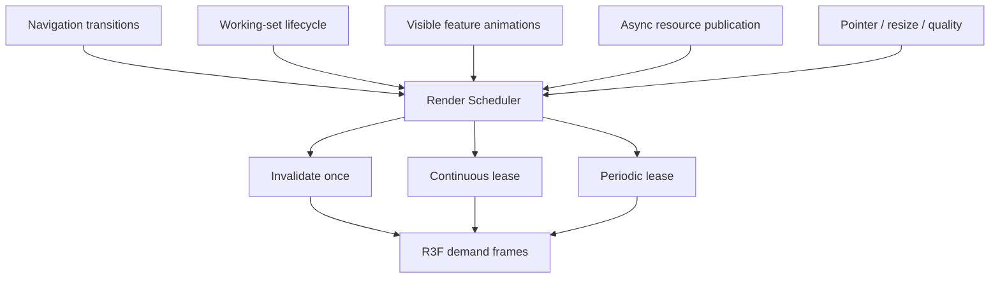
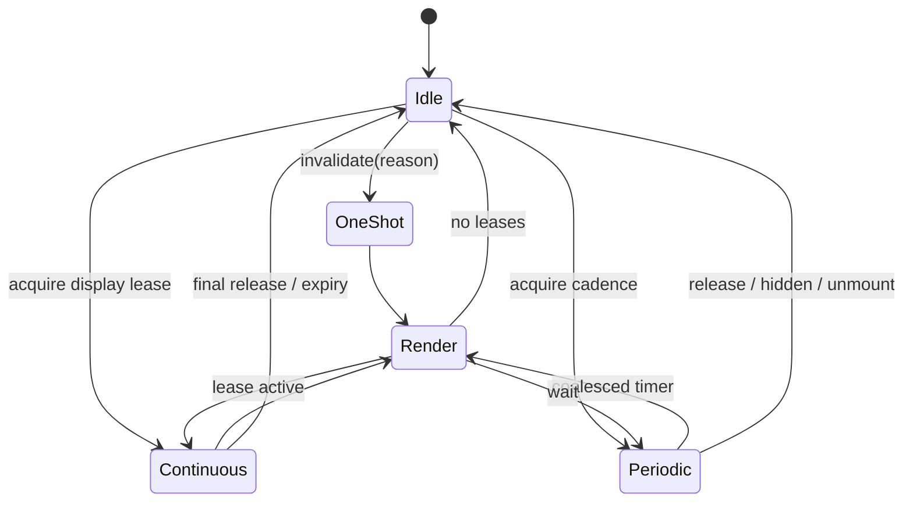

# Phase 4 — Render scheduler design

Scheduling policy is portfolio-owned under
`src/scene/runtime/render-scheduler/`. It does not mutate navigation and the
generic package remains renderer-agnostic.

The Canvas uses `frameloop="demand"`. A bridge installs R3F's `invalidate`,
consumes pending invalidations at the frame boundary, and requests the next
frame only while a display-cadence lease exists. Periodic producers share a
coalesced timer; hidden tabs cancel it.

Leases are keyed by `ownerId + typed reason`. Renewing a duplicate increments a
generation; a stale release cannot remove the renewed lease. Owners and
working-set lifecycle IDs can be released idempotently. Bounded leases expire.
Navigation has an additional 15-second safety timeout and development warning.

Component hooks clean all owned releases on unmount. Visibility restoration,
resize, DPR, effects remount, working-set state and active texture publication
are attributed one-shots. Cancelled texture loads dispose their result and do
not publish an `asset-ready` invalidation.

Idle means no display lease and no pending one-shot. A periodic ambient lease
is reported as periodic, not idle. `framesWhileIdle` identifies frames without
a scheduler reason. Adaptive DPR receives only rendered samples; absence of
idle frames cannot produce an upgrade, and a DPR change clears its sample
window and invalidates once.
